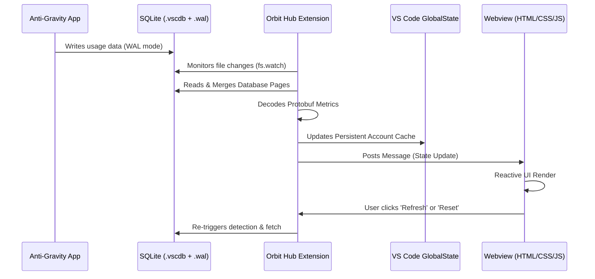

# Orbit Hub

[](package.json)
[](https://code.visualstudio.com/)

**Orbit Hub** is a premium model quota dashboard built exclusively for users of the **Anti-Gravity IDE**. It provides real-time monitoring and visualization of model credits (Gemini, Claude, GPT) for all your linked Gmail accounts, all within a single VS Code sidebar.


---

## 🛠️ Key Engineering Highlights

Orbit Hub is more than just a dashboard. It solves several non-trivial engineering challenges:

### ⚡ Atomic SQLite WAL Merging
VS Code extensions typically struggle with reading databases while another application (like Anti-Gravity) holds a write lock. Orbit Hub implements a custom **Write-Ahead Log (WAL) merging engine** that manually reads and resolves sidecar `-wal` files into a memory-resident SQLite buffer.
- **Why**: Standard `fs.readFileSync` on a locked `.vscdb` file results in stale data.
- **How**: The extension patches the SQLite header from WAL-mode (write_version=2) to Legacy-mode (version=1) on the fly, forcing the WASM-based SQL.js engine to read the manually merged pages from the provided buffer.

### 🧩 Schema-less Protobuf Decoding
The quota data is stored in complex, deeply nested Protobuf structures without publicly available `.proto` files. Orbit Hub features a custom **binary field decoder** that recursively navigates these structures to extract:
- Remaining credit percentages.
- Reset/Refill timestamps (millisecond precision).
- Model-specific display names and UUIDs.

### 🧪 Optimistic UI Engine
To provide a seamless experience across multiple accounts without constant re-authentication:
- **Active Tracker**: Live-syncs with the currently authenticated session using the VS Code Authentication API.
- **Estimation Engine**: For cached (inactive) accounts, the extension predicts credit resets based on the last known refill schedule, giving users an "at-a-glance" status of all their resources.

---

## 🏗️ System Architecture

The following diagram illustrates the data flow from the local state storage to the interactive webview.



---

## ✨ Features

- **Anti-Gravity Integration**: Seamlessly syncs with the Anti-Gravity IDE's internal state to detect active Gmail accounts.
- **Dynamic Live Tooltips**: Horizontal mouse tracking on quota bars provides real-time percentage feedback.
- **Optimized Caching**: SQL WASM binary is cached globally to ensure near-instantaneous UI refreshes.
- **Safe State Management**: Comprehensive "Remove Account" and "Reset All Data" commands with modal confirmation safeguards.
- **Stale Data Detection**: Visual warnings when a local sync is pending or data is more than an hour old.

---

## 🚀 Installation & Development

### Local Installation
To install Orbit Hub in your current editor:
```bash
npm run install:local
```
This script compiles the extension, packages it as a `.vsix`, and installs it directly into your active VS Code/Cursor environment.

### Development Flow
1. Clone the repository.
2. Run `npm install`.
3. Launch the `Extension Development Host` via `F5` in VS Code.
4. Use `npm run watch` to automatically recompile on changes.

---

## 🧰 Tech Stack

- **Backend**: TypeScript, Node.js (fs, path, crypto).
- **Database**: [SQL.js](https://github.com/sql-js/sql.js) (WASM build).
- **Frontend**: Vanilla HTML5, Modern CSS Variables (Themed), ES6 JavaScript.
- **APIs**: VS Code Webview API, GlobalState API, Authentication API.

---

Created with ❤️ by **Ameya Kulkarni**
