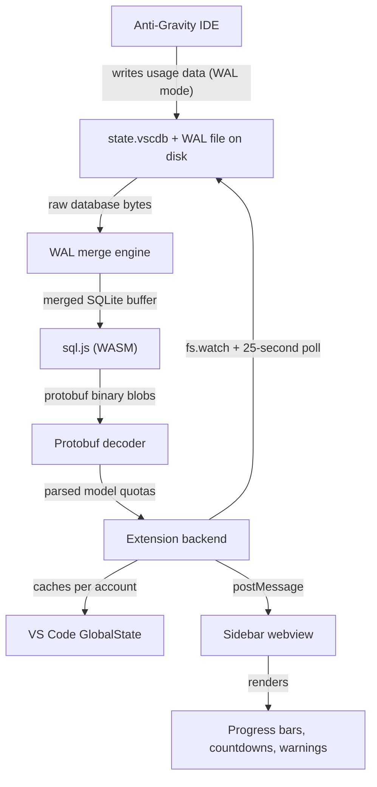
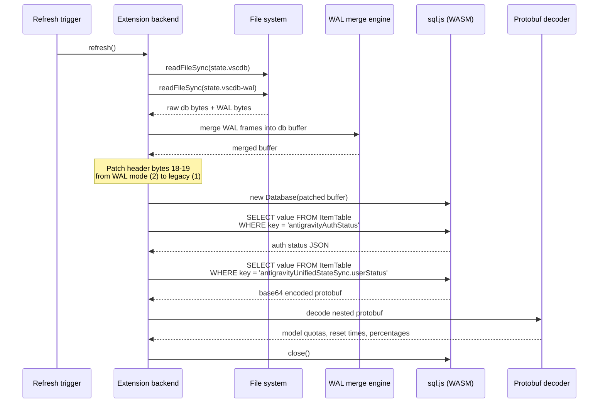
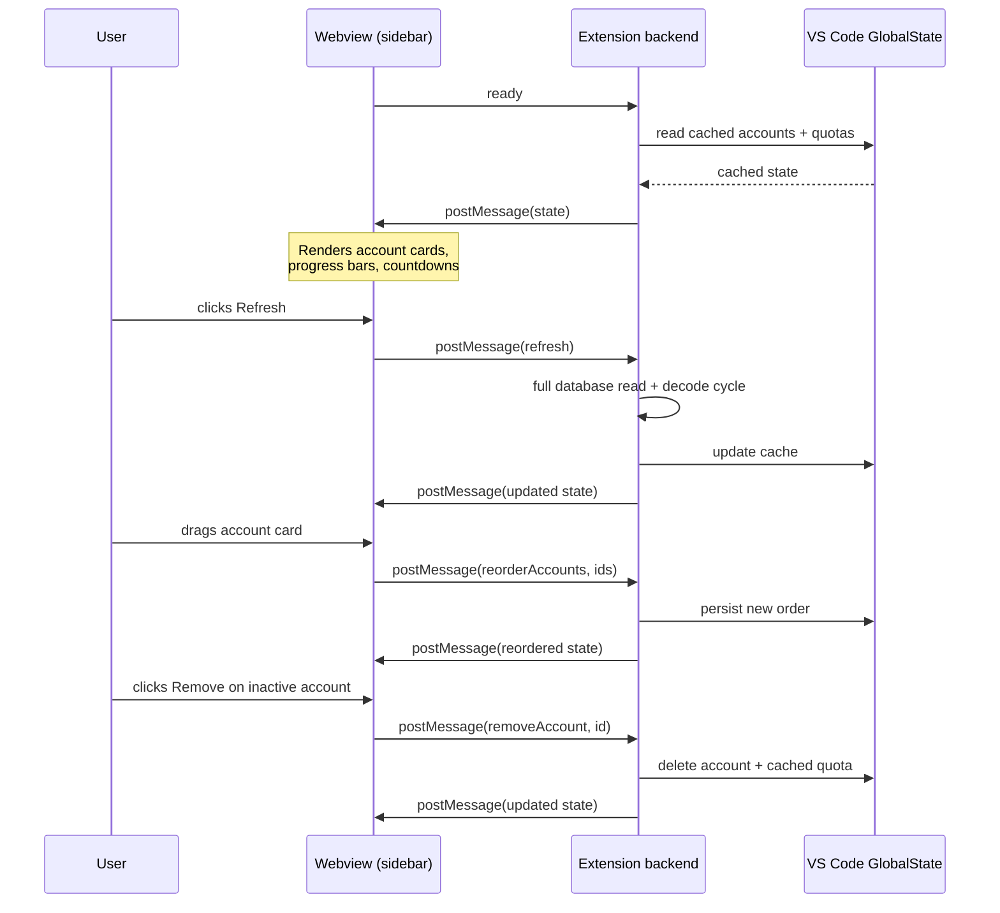

# Orbit Hub

[](package.json)
[](https://code.visualstudio.com/)
[](https://www.typescriptlang.org/)
[](LICENSE)

Orbit Hub is a VS Code sidebar extension built exclusively for the Anti-Gravity IDE. It reads the IDE's internal SQLite state database, decodes quota information from raw protobuf payloads, and renders a real-time, multi-account dashboard showing remaining model credits for Gemini 3.1 Pro, Gemini 3 Flash, Claude Sonnet 4.6, Claude Opus 4.6, and GPT-OSS 120B. Every linked Google account appears in a single panel with segmented progress bars, live countdown timers to the next quota reset, and visual warnings when credits are running low or data is stale.

## How it works

The core technical challenge Orbit Hub solves is that Anti-Gravity writes its usage data into a WAL-mode SQLite database, and the main database file is only flushed to disk when Anti-Gravity checkpoints (typically on shutdown). That means a naive `fs.readFileSync` on the `.vscdb` file returns stale data. Orbit Hub works around this by implementing a custom WAL merge engine that reads the write-ahead log from disk, replays committed frames into a memory buffer, and patches the SQLite header bytes from WAL mode to legacy journal mode before handing the buffer to the WASM-based sql.js engine. The quota payloads inside the database are stored as nested protobuf binaries without publicly available `.proto` schema files, so Orbit Hub includes a zero-dependency protobuf decoder that walks the wire format recursively to extract credit percentages, reset timestamps, and model display names.

The following three diagrams break down the full data flow from the Anti-Gravity IDE all the way to the user's screen. The first diagram shows the high-level pipeline. The second shows exactly what happens when the extension reads the database. The third shows how the webview interacts with the extension backend.

### Data pipeline overview

This is the end-to-end flow. Anti-Gravity writes to disk, the extension watches for changes, decodes the data, caches it, and pushes it to the webview for rendering.



### Database read and decode sequence

This diagram zooms into what happens each time a refresh is triggered, whether by a file-system change event, the 25-second polling timer, or a manual refresh from the user. The extension reads both the main database file and the WAL sidecar, merges the WAL frames into the database buffer, patches the header, opens it with sql.js, queries the relevant rows, and decodes the protobuf contents.



### Webview interaction flow

This diagram shows how the sidebar webview communicates with the extension backend. All communication happens through the VS Code `postMessage` / `onDidReceiveMessage` API. The webview never reads files or databases directly.



## Features

Orbit Hub tracks quota usage across all models currently supported by the Anti-Gravity IDE. Each model is displayed as a segmented five-bar indicator that fills from left to right based on the remaining credit percentage. When a quota drops below 20 percent, the bar turns orange and a warning icon appears. When it hits zero, the bar greys out entirely. Each model row also shows a live countdown timer to the next reset window, which ticks down in real time every second without requiring a page refresh. For models with a five-hour reset cycle (such as Gemini 3 Flash) or a seven-day cycle (such as Claude and Gemini Pro), the countdown format adjusts automatically between days/hours and hours/minutes/seconds.

The extension supports multiple Google accounts simultaneously. When you switch accounts in Anti-Gravity, Orbit Hub detects the change within seconds by watching the authentication status in the state database and, when available, through a direct in-process API call. The previously active account is preserved in the sidebar with its last-known quota snapshot, and the extension uses an estimation engine to predict whether credits have reset based on the stored refill schedule. Estimated values are shown with a green "available" indicator so you can see at a glance which accounts have fresh credits without needing to switch to them.

Account cards in the sidebar can be reordered by dragging. Each card shows the account email, a green or grey dot indicating whether the account is currently active, the last sync timestamp, and a remove button. Removing an account clears its cached quota data permanently. The active account cannot be removed; you must switch to a different account in Anti-Gravity first. A "Reset all data" link at the bottom of the panel clears all accounts and cached quotas, with a confirmation dialog to prevent accidental data loss.

Hovering over any progress bar reveals a tooltip that tracks your mouse position horizontally across the bar, showing the exact remaining percentage. The tooltip follows the cursor in real time and disappears as soon as the mouse leaves the bar area. When quota data is more than an hour old for the active account, a stale data warning appears alongside the model name, along with the age of the data and a suggestion to open the Anti-Gravity app to trigger a sync.

## Installation

A pre-built `.vsix` file is attached to this repository's releases. To install it, open your editor (Anti-Gravity, VS Code, Cursor, or any compatible fork), open the Command Palette, and run `Extensions: Install from VSIX...`. Select the downloaded `.vsix` file and reload the window when prompted. The extension will appear as a new icon in the activity bar on the left side of the editor.

If you prefer to build from source, clone the repository, run `npm install` to fetch dependencies, and then run `npm run install:local`. This script compiles the TypeScript, packages the extension, and installs it into whichever editor CLI it finds on your system. After installation, run "Developer: Reload Window" from the Command Palette.

## Quick Install

> **Note:** Orbit Hub is built exclusively for the Anti-Gravity IDE. While the extension can be installed in VS Code or Cursor, it will not function there — it relies on Anti-Gravity's internal state database and APIs.

One command to download and install the latest release:

```bash
curl -sSL https://raw.githubusercontent.com/amEya911/Orbit-Hub/main/install.sh | bash
```

The script automatically detects your editor CLI (`antigravity`, `cursor`, or `code`), downloads the latest `.vsix` from GitHub Releases, and installs it.

### Manual install

If you prefer to install manually, download the `.vsix` from the [latest release](https://github.com/amEya911/Orbit-Hub/releases/latest) and run:

```bash
# Replace with the path to the downloaded file
antigravity --install-extension orbit-hub-manager-*.vsix
```

You can substitute `antigravity` with `cursor` or `code` depending on your editor.

## Configuration

Orbit Hub requires no manual configuration. It resolves the Anti-Gravity state database path automatically based on your operating system. On macOS, it looks in `~/Library/Application Support/Antigravity/User/globalStorage/state.vscdb`, with a fallback to the `Anti-Gravity` directory variant. On Windows, the equivalent path is `%APPDATA%\Antigravity\User\globalStorage\state.vscdb`. On Linux, it checks `~/.config/Antigravity/User/globalStorage/state.vscdb`. The extension tries both naming conventions on all platforms and uses whichever path exists on disk. If neither exists (because Anti-Gravity is not installed or has never been run), the sidebar displays a "Detecting account" state until the database becomes available.

Accounts are detected and added to the dashboard automatically when you sign in to Anti-Gravity. When you switch between Google accounts, the extension cross-references the authentication status (which updates instantly on switch) with the user status protobuf (which contains the actual quota data) to ensure the correct quota is displayed under the correct email. During the brief window where Anti-Gravity is syncing the new account's quota data from its servers, the extension retries every two seconds for up to sixty seconds so that the dashboard updates as quickly as possible after a switch.

## Running in development

Clone the repository, run `npm install`, and then run `npm run compile` to build the TypeScript source. To launch the extension in a sandboxed environment, press F5 in VS Code, which opens an Extension Development Host window with the extension loaded. For continuous development, use `npm run watch` to recompile automatically on every file save. The `.vscode/launch.json` and `.vscode/tasks.json` files are already configured for this workflow.

## System architecture

The extension is structured as four TypeScript modules and one vanilla JavaScript webview frontend. The entry point (`extension.ts`) registers commands, sets up a file-system watcher on the state database directory, and starts a 25-second polling timer as a fallback for platforms where `fs.watch` may miss events. The `AccountManager` handles all CRUD operations for accounts and quota caches using VS Code's `GlobalState` API, which persists data across editor restarts. The `QuotaFetcher` is the core engine: it reads the database from disk, merges WAL pages, queries the relevant rows, and decodes the protobuf payloads into structured model quota objects. The `OrbitHubProvider` is the `WebviewViewProvider` that builds the HTML shell, orchestrates the refresh cycle, manages a sync-retry window during account switches, and serializes the full dashboard state into a single `postMessage` payload. The webview frontend (`main.js` and `style.css`) renders the account cards, progress bars, and countdown timers using vanilla DOM manipulation and CSS custom properties that inherit the editor's active theme.

## Tech stack

The extension backend is written in TypeScript targeting ES2020 with strict mode enabled, and runs on Node.js using the `fs`, `path`, `crypto`, and `os` standard library modules. The SQLite database is read using sql.js, a pure-WASM build of SQLite that runs entirely in-process without any native bindings or platform-specific compilation. The WASM binary is cached in memory after the first load to avoid repeated file-system reads. The webview frontend is built with vanilla HTML5, CSS3 with VS Code theme variable integration, and ES6 JavaScript. There are no frontend frameworks, bundlers, or external CSS libraries. The extension communicates with the webview exclusively through the VS Code Webview API's `postMessage` and `onDidReceiveMessage` methods. Authentication state is monitored through the VS Code Authentication API, and when running inside Anti-Gravity, the extension can also use the proposed `antigravityUnifiedStateSync` API for faster, more reliable account detection.

## License

MIT. See [LICENSE](LICENSE).
